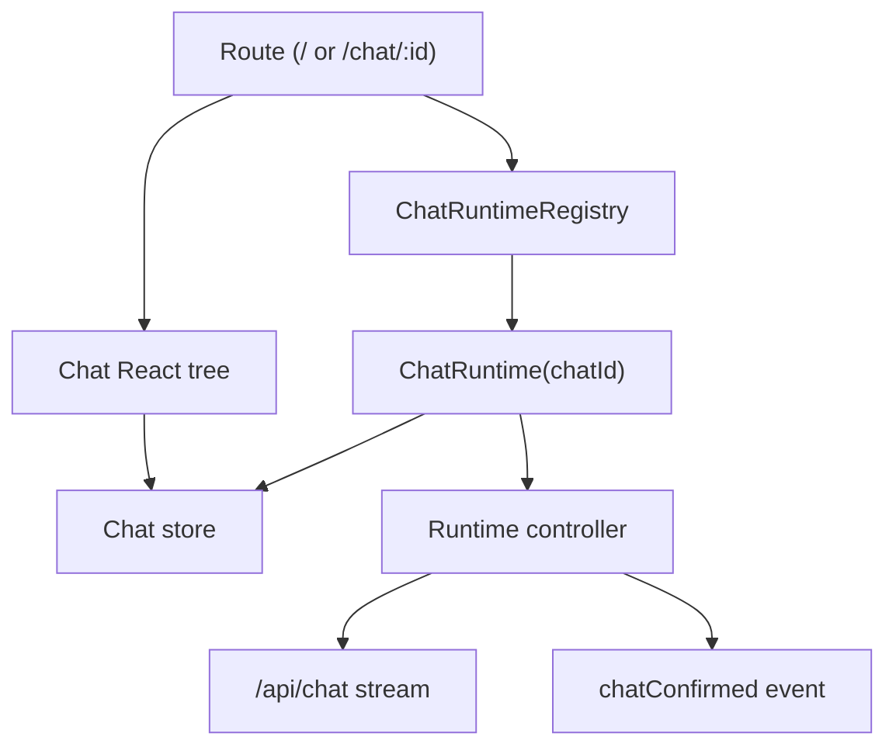

# Chat Runtime Migration Plan

## Goal

Move chat execution from a route-scoped controller to persistent per-chat runtimes.
The route should become a view over a runtime, not the owner of streaming,
message state, provisional persistence, or background work.

This enables ChatGPT-style behavior:

- A stream started in one chat continues after navigating away.
- Multiple chats can stream concurrently.
- Navigating between chats only swaps the visible runtime.
- Provisional chats render optimistically before the database row exists.
- Backend queries that require persisted chat rows are gated until confirmation.

## Current Prototype State

The prototype has proven the key design:

- `ChatRuntimeRegistryProvider` owns live chat runtime entries.
- Each runtime owns a chat store instance.
- `PersistentChatRuntimes` keeps runtime controllers mounted outside the route tree.
- `ChatRouteHost` can render a visible route from a live runtime store.
- Provisional route queries are disabled until the runtime is confirmed.

The base store code remains generic. Multi-chat behavior is layered above it in
the runtime registry/provider.

## Target Architecture

The runtime is the unit of execution. The route only chooses which runtime is
visible.

## Runtime Model

Each runtime should eventually track:

- `chatId`
- `runtimeId`
- `projectId`
- `source`
- `store`
- `pendingSubmission`
- `submittedMessage`
- `requestSpecs`
- `persistenceStatus`: `provisional | confirmed`
- `streamStatus`: `idle | submitted | streaming | complete | error | stopped`
- `lastActiveAt`

The current branch has only the minimum needed for the prototype:

- runtime identity
- owned store
- pending submission
- provisional/confirmed persistence state

## Migration Phases

### Phase 1: Runtime Owns Provisional Lifecycle

Status: complete.

Move route-transition responsibilities into the runtime registry:

- Start provisional runtime from draft submit.
- Keep the controller mounted outside route transitions.
- Mark the runtime confirmed from `data-chatConfirmed`.
- Gate persisted route queries while provisional.
- Invalidate persisted queries after confirmation.
- Run secondary parallel request specs from the runtime controller.

This removes the duplicate route-transition mental model. The runtime registry
now owns provisional creation, pending submission startup, confirmation,
post-confirmation invalidation, and secondary parallel request execution.

### Phase 2: Runtime API Boundary

Add a small public runtime API so components stop reaching directly into store
internals:

- `getRuntime(chatId)`
- `getOrCreateDraftRuntime(projectId)`
- `startProvisionalRuntime(input)`
- `sendMessage(chatId, message, options)`
- `markConfirmed(chatId)`
- `disposeRuntime(chatId)`
- `useRuntimeStore(chatId)`

The store remains a generic local state primitive. Runtime-specific behavior
lives in the runtime layer.

### Phase 3: Migrate Chat Actions

Route-local actions must resolve the intended runtime explicitly:

- send message
- suggested actions
- follow-up suggestions
- retry/regenerate
- edit message
- sibling navigation
- artifact actions
- tool result submission
- stop/resume

The rule should be: actions target a `chatId`/runtime, not whatever controller is
currently mounted in the visible route.

### Phase 4: Query Gating Audit

Audit every query that assumes `/chat/:id` means the chat exists in the
database:

- `chat.getChatById`
- `chat.getChatMessages`
- `vote.getVotes`
- breadcrumb/project metadata
- feedback state
- message navigation helpers
- sidebar refreshes caused by chat invalidation

Queries that need persistence should require either no live runtime or a
confirmed live runtime.

### Phase 5: Multi-Chat Concurrency

Support multiple active runtimes:

- each runtime has its own controller and data stream
- visible chat attaches to the runtime store
- background streams continue while hidden
- sidebar/title updates react to confirmation and completion
- errors surface without stealing focus from the visible chat

### Phase 6: Runtime Cleanup

Add explicit eviction policy:

- never evict active streams
- keep recently viewed runtimes for a short TTL
- evict confirmed idle runtimes once persisted data is fresh
- evict failed provisional runtimes after user leaves or dismisses them
- clear runtimes on logout/session change

### Phase 7: Tests

Add focused tests for:

- provisional chats do not fetch persisted chat queries
- confirmation enables persisted queries
- home navigation does not show previous chat messages
- returning to a live chat reuses the same store
- two provisional chats can stream independently
- React Strict Mode does not double-submit
- runtime cleanup does not kill active streams

## Decisions Still Needed

- Whether confirmed completed chats should remain memory-backed or hand off to
  persisted query data immediately.
- How long idle runtimes should remain mounted.
- Whether historical chats get runtimes on route entry or only when they stream.
- Whether `ChatSync` should be renamed/split into `ChatRuntimeController`.
- How background runtime errors should notify the user.
- Whether `DataStreamProvider` remains per-runtime or becomes part of the
  runtime entry itself.

## Recommended Next Step

Start Phase 2 by adding a narrow runtime API boundary around the registry. The
first useful slice is a `sendMessage(chatId, message, options)` entry point so
chat actions can target runtimes explicitly instead of depending on whichever
controller is mounted in the visible route.
