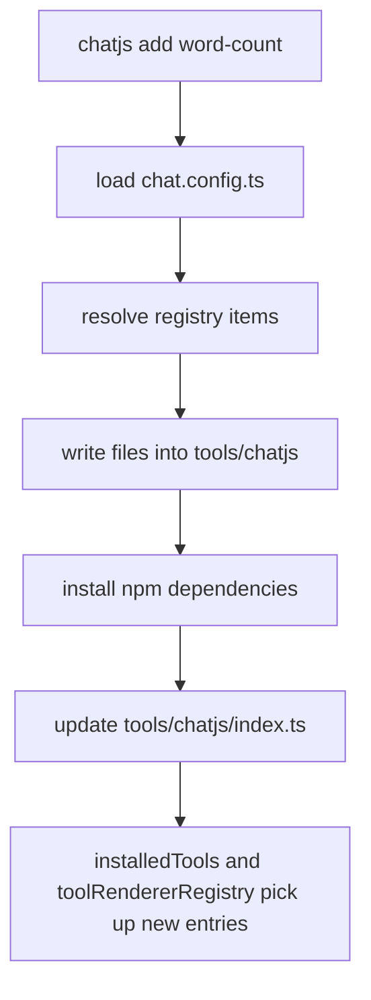
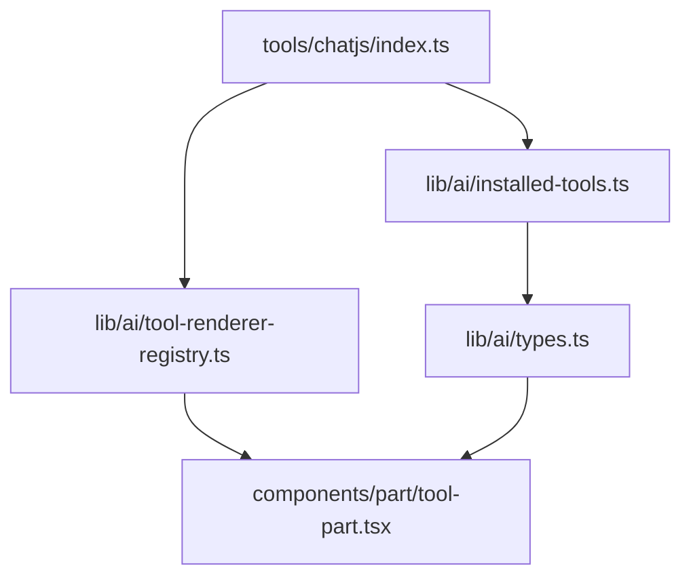

This recipe explains what `chatjs add` does to your project and how the registry install flow works under the hood.

For the user-facing overview of the registry itself, start with [Tool Registry](../core/tool-registry).

## Problem

You want to distribute a tool as source code that another ChatJS app can install, type-check, and render without manual wiring.

That means installation needs to do more than download a single file. It has to:

- copy the tool implementation into the app
- copy its renderer and any shared helper files
- install npm dependencies
- register the tool so the model can call it
- register the UI so tool parts render correctly

## Solution

`chatjs add` installs a registry item into the app's installable tools namespace at `tools/chatjs` by default.

```bash
npx @chat-js/cli@latest add word-count
```

The command resolves the requested item, installs any registry dependencies, writes all declared files, then updates the CLI-managed registry index.

## Install Flow

The current flow is:

1. Load `chat.config.ts` and resolve `paths.tools`
2. Fetch the requested registry item JSON
3. Recursively resolve `registryDependencies`
4. Write every declared file into the tools directory
5. Rewrite `@toolkit/*` imports into local project imports under `tools/chatjs/_shared`
6. Install the combined npm dependencies and dev dependencies
7. Inject tool and UI registrations into `tools/chatjs/index.ts`



## Registry Item Shape

Each installable item is a JSON manifest. It declares files to copy plus dependency metadata.

```json title="packages/registry/items/get-weather.json"
{
  "name": "get-weather",
  "description": "Get the current weather at a location",
  "dependencies": ["ai", "date-fns", "zod"],
  "registryDependencies": ["toolkit-renderer"],
  "files": [
    {
      "path": "tool.ts",
      "type": "tool",
      "target": "get-weather/tool.ts",
      "content": "..."
    },
    {
      "path": "renderer.tsx",
      "type": "renderer",
      "target": "get-weather/renderer.tsx",
      "content": "..."
    }
  ]
}
```

`registryDependencies` let one registry item pull in another. In this branch, `get-weather` depends on `toolkit-renderer`, which installs shared files like `_shared/lib/cx.ts` and `_shared/hooks/use-tool-is-compact.ts`.

## What Changes In Your Project

After installation, your project will usually gain:

```text
tools/
  chatjs/
    index.ts
    word-count/
      tool.ts
      renderer.tsx
    _shared/
      hooks/
      lib/
```

The CLI also updates the managed index:

```ts title="tools/chatjs/index.ts"
// [chatjs-registry:imports]
import { WordCountRenderer } from "@/tools/chatjs/word-count/renderer";
import { wordCount } from "@/tools/chatjs/word-count/tool";
// [/chatjs-registry:imports]

export const tools = {
  // [chatjs-registry:tools]
  wordCount,
  // [/chatjs-registry:tools]
} as const;

export const ui = {
  // [chatjs-registry:ui]
  "tool-wordCount": WordCountRenderer,
  // [/chatjs-registry:ui]
};
```

You do not edit this file by hand. The CLI owns the marker blocks and injects entries idempotently.

## How The Installed Tool Becomes Available

Once `tools/chatjs/index.ts` is updated, the rest of the app picks up the new tool through two static wrappers:

- `lib/ai/installed-tools.ts` derives `InstalledTools` from the `tools` export
- `lib/ai/tool-renderer-registry.ts` exposes the `ui` map as the renderer registry



This keeps installable tools separate from built-in platform tools while still making them first-class typed tools in the app.

## Key Files

| File | Role |
| --- | --- |
| `packages/cli/src/commands/add.ts` | Main install flow for `chatjs add` |
| `packages/cli/src/registry/resolve.ts` | Recursively resolves registry dependencies |
| `packages/cli/src/utils/write-files.ts` | Writes files and rewrites `@toolkit/*` imports |
| `packages/cli/src/utils/inject-tool.ts` | Updates the CLI-managed registry index |
| `apps/chat/lib/ai/installed-tools.ts` | Derives typed installed tools |
| `apps/chat/lib/ai/tool-renderer-registry.ts` | Registers installed renderers |

## Notes

- The registry index is created automatically if it does not exist yet.
- Re-installing a tool is safe because registration is idempotent.
- Existing files are preserved unless you confirm an overwrite or pass `--overwrite`.
- The registry can distribute more than `tool.ts` and `renderer.tsx`. It can also ship shared libs, components, and hooks.

## Related

- [Tool Registry](../core/tool-registry) for the conceptual overview
- [Tools](./tools) for building and publishing registry tools
- [CLI add](../cli/add) for the command reference
