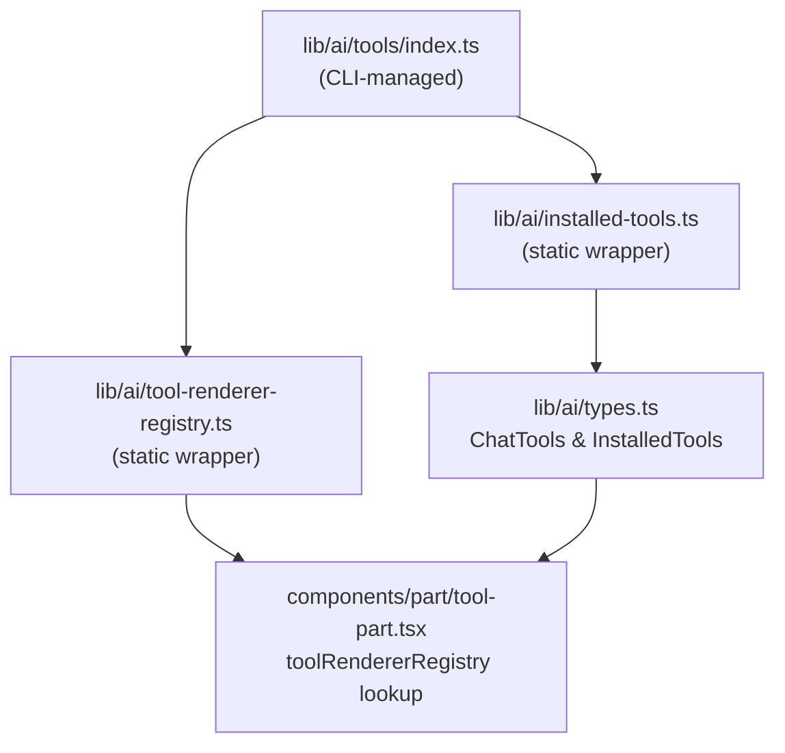

> Build a self-contained tool that the `chatjs add` CLI command can install into any ChatJS project.

## Overview

The registry system lets you package a backend AI tool and its frontend renderer as a distributable unit. Once installed, the tool is available to the AI model and its output is rendered with your custom component -- with full TypeScript type safety end to end.

This recipe covers how the system works and what files make up an installable tool.

## How it works

Installing a tool does three things:

1. Copies the tool implementation and renderer into the project
2. Injects the tool into `lib/ai/tools/index.ts`, the single file the CLI manages
3. The static wrappers (`installed-tools.ts`, `tool-renderer-registry.ts`) automatically pick up the new entries



## File structure

Each tool lives in its own folder. The CLI copies two files and injects entries for all three into the registry index.

| File | What it contains |
|------|-----------------|
| `tools/{name}/tool.ts` | Backend tool: schema + `execute` function |
| `tools/{name}/renderer.tsx` | Frontend renderer component |
| `tools/index.ts` | Registry index -- CLI injects imports and entries here |

## Code

### 1. Backend tool

Registry tools use `tool()` from the AI SDK directly — they are plain tools that take input and return output.

```ts title="tools/word-count/tool.ts"
import { tool } from "ai";
import { z } from "zod";

export const wordCount = tool({
  description: "Count the words, characters, and sentences in a given text",
  inputSchema: z.object({
    text: z.string().describe("The text to analyze"),
  }),
  execute: async ({ text }: { text: string }) => {
    const words = text.trim() === "" ? 0 : text.trim().split(/\s+/).length;
    const characters = text.length;
    const charactersNoSpaces = text.replace(/\s/g, "").length;
    const sentences = text
      .split(/[.!?]+/)
      .filter((s) => s.trim().length > 0).length;

    return { words, characters, charactersNoSpaces, sentences };
  },
});

export type WordCountOutput = {
  words: number;
  characters: number;
  charactersNoSpaces: number;
  sentences: number;
};
```

### 2. Frontend renderer

The renderer imports `WordCountOutput` from the tool file and defines a local `WordCountPart` type. This avoids the circular import that would arise from importing through `@/lib/ai/types` (which depends on the tools registry).

```tsx title="tools/word-count/renderer.tsx"
"use client";

import type { WordCountOutput } from "./tool";

// Typed locally to avoid circular imports (tools/ ← lib/ai/types ← installed-tools ← tools/)
type WordCountPart =
  | { state: "input-available" | "input-streaming"; output?: never }
  | { state: "output-available"; output: WordCountOutput };

export function WordCountRenderer({ tool }: { tool: unknown }) {
  const part = tool as WordCountPart;

  if (part.state === "input-available") {
    return (
      <div className="text-muted-foreground rounded-lg border p-3 text-sm">
        Counting words...
      </div>
    );
  }

  if (part.state !== "output-available") {
    return null;
  }

  const { words, characters, charactersNoSpaces, sentences } = part.output;

  return (
    <div className="grid grid-cols-2 gap-2 rounded-lg border p-3 text-sm sm:grid-cols-4">
      <Stat label="Words" value={words} />
      <Stat label="Characters" value={characters} />
      <Stat label="No spaces" value={charactersNoSpaces} />
      <Stat label="Sentences" value={sentences} />
    </div>
  );
}

function Stat({ label, value }: { label: string; value: number }) {
  return (
    <div className="flex flex-col items-center gap-1">
      <span className="font-semibold text-lg">{value}</span>
      <span className="text-muted-foreground text-xs">{label}</span>
    </div>
  );
}
```

### 3. Registry index (CLI-managed)

The CLI appends one import and one entry per tool to each of the three managed blocks. You do not edit this file manually.

```ts title="tools/index.ts"
// [chatjs-registry:imports]
import { WordCountRenderer } from "@/tools/word-count/renderer";
import { wordCount } from "@/tools/word-count/tool";
// [/chatjs-registry:imports]

export const tools = {
  // [chatjs-registry:tools]
  wordCount,
  // [/chatjs-registry:tools]
} as const;

export const ui = {
  // [chatjs-registry:ui]
  "tool-wordCount": WordCountRenderer,
  // [/chatjs-registry:ui]
};
```

## Type flow

`installed-tools.ts` derives `InstalledTools` from the `tools` export via a mapped `InferUITool` type. `types.ts` intersects this with the built-in `ChatTools`, so installed tools become first-class typed members of the union.

```
tools (as const) → InstalledTools → ChatTools & InstalledTools → ToolUIPart<ChatTools>
```

Renderers receive `{ tool: unknown }` and cast to a locally defined type. The local type is built from the exported `WordCountOutput` type in `tool.ts`, keeping the renderer isolated from the `@/lib/ai/types` import chain (which would cause a circular dependency via `installed-tools → tools/index`). The `output` field is fully typed — no `unknown` beyond the initial cast.

## Path configuration

The CLI reads `paths` from `chat.config.ts` to know where to copy files and which import aliases to write into the registry index. The defaults match the out-of-the-box project layout.

```ts title="chat.config.ts"
export default defineConfig({
  // ...
  paths: {
    tools:  "@/tools",
    toolUi: "@/tools",
  },
});
```

## Registry manifest

When you publish a tool to a registry, the manifest tells the CLI which files to copy and what entries to inject.

```json
{
  "name": "word-count",
  "files": [
    { "type": "tool",     "path": "word-count/tool.ts"     },
    { "type": "renderer", "path": "word-count/renderer.tsx" }
  ],
  "registry": {
    "toolExport":     "wordCount",
    "rendererExport": "WordCountRenderer",
    "rendererKey":    "tool-wordCount"
  }
}
```

## Related

- [Tool Part](/cookbook/tool-part) -- how built-in tools connect a backend definition to a frontend component
