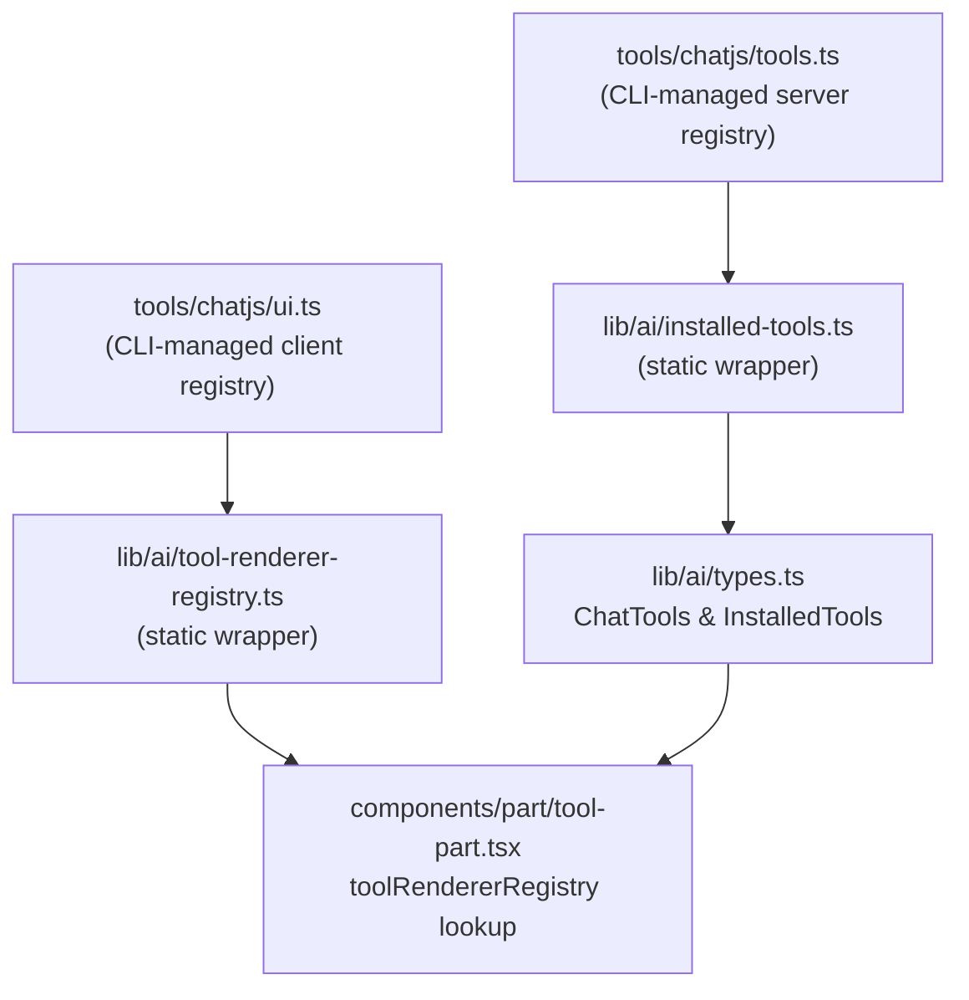

> Build a self-contained tool that the `chatjs add` CLI command can install into any ChatJS project.

For the product-level overview of the registry and when to use it, start with [Tool Registry](../core/tool-registry).

## Overview

The registry system lets you package a backend AI tool and its frontend renderer as a distributable unit. Once installed, the tool is available to the AI model and its output is rendered with your custom component -- with full TypeScript type safety end to end.

This recipe covers how the system works and what files make up an installable tool.

## How it works

Installing a tool does three things:

1. Copies the tool implementation and renderer into the project
2. Injects the tool into `tools/chatjs/tools.ts` and `tools/chatjs/ui.ts`, the two files the CLI manages
3. The static wrappers (`installed-tools.ts`, `tool-renderer-registry.ts`) automatically pick up the new entries while built-in tools stay under `tools/platform`



## File structure

Each tool lives in its own folder. The CLI copies two files and injects entries for all three into the registry index.

| File | What it contains |
|------|-----------------|
| `tools/chatjs/{name}/tool.ts` | Backend tool: schema + `execute` function |
| `tools/chatjs/{name}/renderer.tsx` | Frontend renderer component |
| `tools/chatjs/tools.ts` | Server registry file -- CLI injects tool imports and entries here |
| `tools/chatjs/ui.ts` | Client registry file -- CLI injects renderer imports and entries here |

## Tool environment variables

If a tool needs environment variables, declare them in `tool.ts` with `toolEnvVars`.

```ts title="tools/chatjs/retrieve-url/tool.ts"
import type { ToolEnvVars } from "@chat-js/registry";
import { tool } from "ai";

export const toolEnvVars: ToolEnvVars = [
  {
    options: [["FIRECRAWL_API_KEY"]],
  },
];

export const retrieveUrl = tool({
  // ...
});
```

This is the source of truth for installable tool env requirements.

- The registry build extracts `toolEnvVars` into the published manifest as `envRequirements`.
- `chatjs add` uses that metadata to warn about missing env vars during installation.
- `check-env` validates installed tools by reading `toolEnvVars` from each installed `tool.ts`.

`description` is optional. If omitted, ChatJS formats a readable fallback from `options`, for example `OPENAI_COMPATIBLE_BASE_URL + OPENAI_COMPATIBLE_API_KEY` or `TAVILY_API_KEY or FIRECRAWL_API_KEY`.

## Code

### 1. Backend tool

Registry tools use `tool()` from the AI SDK directly. They are plain tools that take input and return output.

```ts title="tools/chatjs/word-count/tool.ts"
import { tool } from "ai";
import { z } from "zod";

export const wordCount = tool({
  description: "Count the words, characters, and sentences in a given text",
  inputSchema: z.object({
    text: z.string().describe("The text to analyze"),
  }),
  execute: async ({ text }: { text: string }) => {
    const words = text.trim() === "" ? 0 : text.trim().split(/\s+/).length;
    const characters = text.length;
    const charactersNoSpaces = text.replace(/\s/g, "").length;
    const sentences = text
      .split(/[.!?]+/)
      .filter((s) => s.trim().length > 0).length;

    return { words, characters, charactersNoSpaces, sentences };
  },
});

export type WordCountOutput = {
  words: number;
  characters: number;
  charactersNoSpaces: number;
  sentences: number;
};
```

### 2. Frontend renderer

The renderer imports `WordCountOutput` from the tool file and defines a local `WordCountPart` type. This avoids the circular import that would arise from importing through `@/lib/ai/types` (which depends on the tools registry).

```tsx title="tools/chatjs/word-count/renderer.tsx"
"use client";

import type { WordCountOutput } from "./tool";

// Typed locally to avoid circular imports (tools/ ← lib/ai/types ← installed-tools ← tools/)
type WordCountPart =
  | { state: "input-available" | "input-streaming"; output?: never }
  | { state: "output-available"; output: WordCountOutput };

export function WordCountRenderer({ tool }: { tool: unknown }) {
  const part = tool as WordCountPart;

  if (part.state === "input-available") {
    return (
      <div className="text-muted-foreground rounded-lg border p-3 text-sm">
        Counting words...
      </div>
    );
  }

  if (part.state !== "output-available") {
    return null;
  }

  const { words, characters, charactersNoSpaces, sentences } = part.output;

  return (
    <div className="grid grid-cols-2 gap-2 rounded-lg border p-3 text-sm sm:grid-cols-4">
      <Stat label="Words" value={words} />
      <Stat label="Characters" value={characters} />
      <Stat label="No spaces" value={charactersNoSpaces} />
      <Stat label="Sentences" value={sentences} />
    </div>
  );
}

function Stat({ label, value }: { label: string; value: number }) {
  return (
    <div className="flex flex-col items-center gap-1">
      <span className="font-semibold text-lg">{value}</span>
      <span className="text-muted-foreground text-xs">{label}</span>
    </div>
  );
}
```

### 3. Registry files (CLI-managed)

The CLI appends imports and entries to the managed server and client registry files. You do not edit these files manually.

```ts title="tools/chatjs/tools.ts"
// [chatjs-registry:tool-imports]
import { wordCount } from "@/tools/chatjs/word-count/tool";
// [/chatjs-registry:tool-imports]

export const tools = {
  // [chatjs-registry:tools]
  wordCount,
  // [/chatjs-registry:tools]
} as const;
```

```ts title="tools/chatjs/ui.ts"
// [chatjs-registry:ui-imports]
import { WordCountRenderer } from "@/tools/chatjs/word-count/renderer";
// [/chatjs-registry:ui-imports]

export const ui = {
  // [chatjs-registry:ui]
  "tool-wordCount": WordCountRenderer,
  // [/chatjs-registry:ui]
};
```

## Type flow

`installed-tools.ts` derives `InstalledTools` from the `tools` export via a mapped `InferUITool` type. `types.ts` intersects this with the built-in `ChatTools`, so installed tools become first-class typed members of the union.

```
tools (as const) → InstalledTools → ChatTools & InstalledTools → ToolUIPart<ChatTools>
```

Renderers receive `{ tool: unknown }` and cast to a locally defined type. The local type is built from the exported `WordCountOutput` type in `tool.ts`, keeping the renderer isolated from the `@/lib/ai/types` import chain (which would cause a circular dependency via `installed-tools → tools/chatjs/index`). The `output` field is fully typed with no `unknown` beyond the initial cast.

## Path configuration

The CLI reads `paths.tools` from `chat.config.ts` to know where to copy files and which import alias to write into the registry index. The default matches the out-of-the-box project layout.

```ts title="chat.config.ts"
export default defineConfig({
  // ...
  paths: {
    tools: "@/tools/chatjs",
  },
});
```

## Platform vs installable tools

ChatJS now separates tool code into two buckets:

| Location | Purpose |
|----------|---------|
| `tools/platform` | Built-in product tools and internal helpers |
| `tools/chatjs` | CLI-managed installable tools from the registry |

Only `tools/chatjs/tools.ts` and `tools/chatjs/ui.ts` are managed by `chatjs add`.

## Architecture note

Treat `tools/platform` and `tools/chatjs` as different ownership layers:

- Put a tool in `tools/platform` when it is part of the product runtime, depends tightly on app infrastructure, or needs richer internal contracts.
- Put a tool in `tools/chatjs` when it is a self-contained installable unit that can be copied into another ChatJS project by `chatjs add`.

This boundary is intentional:

1. Installable tools are the extension surface.
2. Platform tools are the built-in product surface.
3. `tools/chatjs/tools.ts` and `tools/chatjs/ui.ts` are the CLI-managed registry files.
4. `paths.tools` configures the installable tools namespace, not the platform tool namespace.

Do not migrate a platform tool into `tools/chatjs` unless it remains useful as a portable package with a small public contract.

## Registry manifest

When you publish a tool to a registry, the manifest is a self-contained JSON payload with the source files, dependency list, and any extracted environment requirements the CLI will install and validate.

## Related

- [Tool Part](/cookbook/tool-part) -- how built-in tools connect a backend definition to a frontend component
