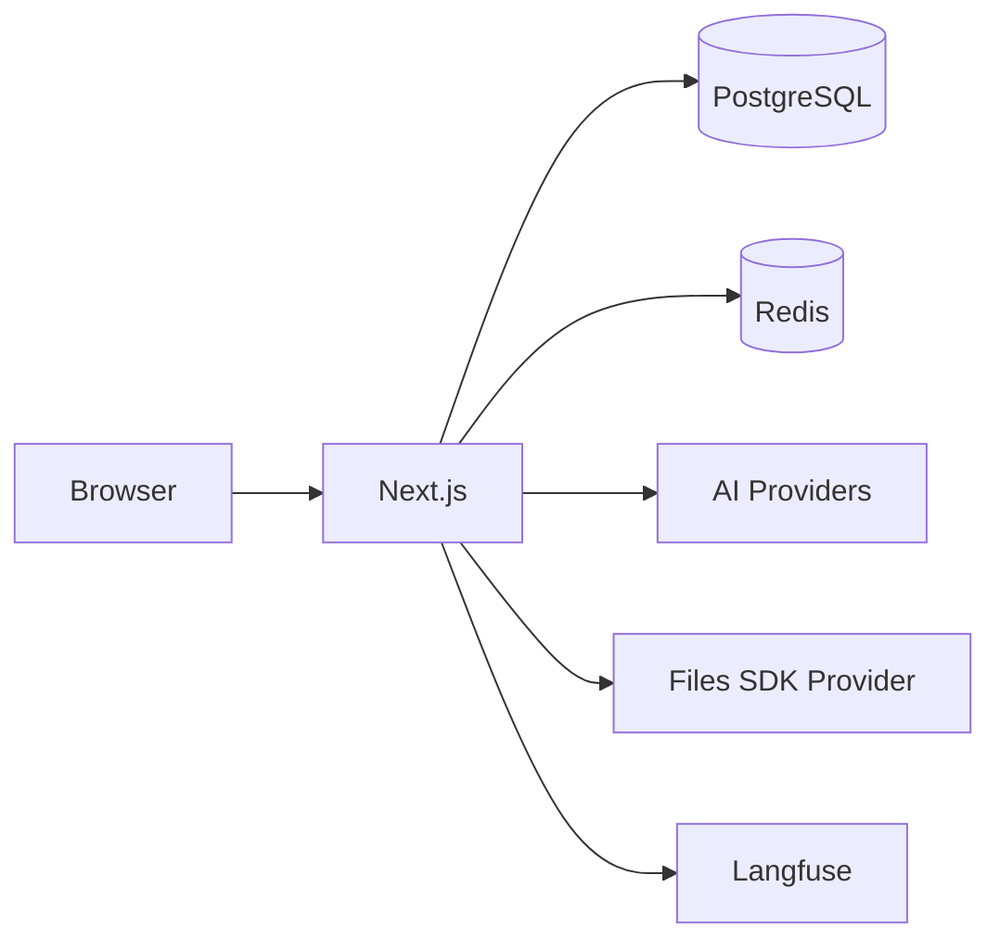
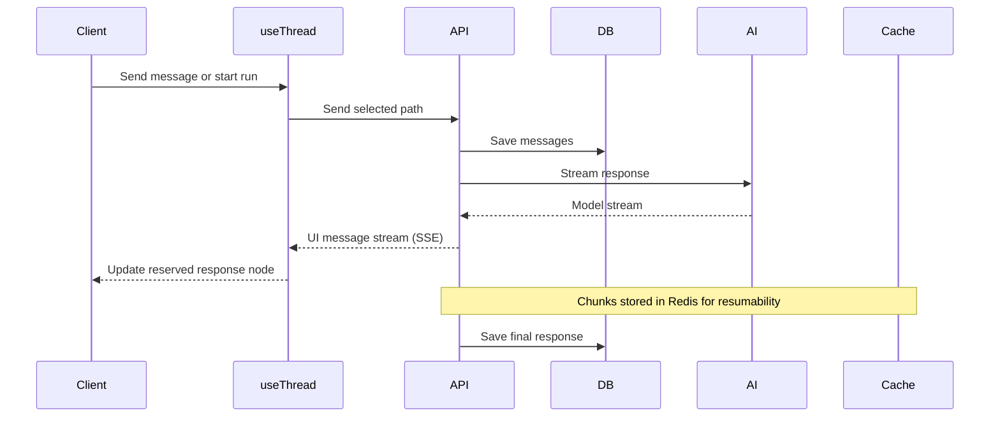

## System Overview

The application uses:
- **Next.js App Router** for the frontend and API routes
- **PostgreSQL** (via [Drizzle ORM](https://orm.drizzle.team)) for persistent data (users, chats, messages, documents)
- **Redis** for ephemeral data (resumable streams, caching). See [Resumable Streams](/cookbook/resumable-streams)
- **AI SDK** to connect to multiple AI providers through a [gateway abstraction](/gateways/overview)
- **`useThread`** to manage the selected conversation path, message tree, and independent response runs. See [useThread](./use-thread)
- **Files SDK** through a configured [file storage provider](./file-storage) for attachments and generated media
- **tRPC** for end-to-end type-safe API routes between client and server
- **Langfuse** (optional) for LLM observability, tracing, and analytics

## Chat Message Flow

When a user sends a message:

Messages are stored with normalized **parts** (text, tool calls, files,
reasoning) allowing efficient querying and streaming updates. Each active
assistant response has its own run, so navigating to another branch does not
redirect or stop that response.

If [resumable streams](/cookbook/resumable-streams) are enabled, response chunks are published to Redis so clients can reconnect mid-generation without losing progress.

## Configuration

All settings flow from a single source:

1. `chat.config.ts` - Your configuration
2. `lib/config/` - Parse and apply defaults
3. `lib/env.ts` - Validate environment variables
4. Runtime - Features enabled/disabled

This ensures type-safe configuration and build-time validation of environment variables. See [Configuration](/core/configuration) for the full reference.
