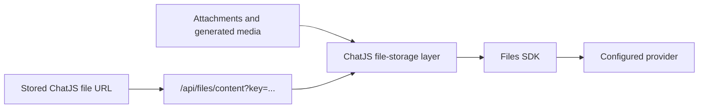

ChatJS uses [Files SDK](https://files-sdk.dev) to store files without coupling
application code to one storage provider. You choose the adapter when you create
the app, and ChatJS uses the same storage layer for uploads, generated media,
downloads, cloning, and cleanup.

Durable file storage is required when you enable any of these capabilities:

- [Attachments](../features/attachments)
- [Image generation](../features/image-generation)
- [Video generation](../features/video-generation)

<Warning>
  The in-memory adapter is suitable for projects that do not use file-backed
  features. Do not use it for persistent files in production.
</Warning>

## Choose a provider

The interactive installer asks you to choose a file storage provider when your
selected features require one:

```bash
npx @chat-js/cli@latest create my-app
```

For a non-interactive installation, pass a provider slug and any non-secret
adapter options:

```bash
npx @chat-js/cli@latest create my-app \
  --storage-provider s3 \
  --storage-config '{"bucket":"uploads","region":"us-east-1"}'
```

The installer derives its choices, peer dependencies, and environment hints
from the Files SDK provider catalog. See the
[Files SDK provider reference](https://files-sdk.dev/docs/providers) for the
available providers and their configuration requirements.

<Note>
  `--storage-config` is only for non-secret adapter options such as a bucket,
  region, endpoint, or runtime binding. Keep tokens, passwords, private keys,
  and other credentials in environment variables or your provider SDK's
  credential chain.
</Note>

## Generated configuration

The installer configures only the selected adapter and its required peer
dependencies.

| File | Responsibility |
| --- | --- |
| `lib/storage-provider.ts` | Selected Files SDK adapter and non-secret options |
| `lib/file-storage.ts` | Shared upload, download, list, and delete operations |
| `.env.example` | Environment hints for the selected provider |
| `scripts/check-env.ts` | Build-time validation for provider requirements |

For example, a Vercel Blob installation generates an adapter like this:

```typescript title="lib/storage-provider.ts"
import type { ProviderSlug } from "files-sdk/providers";
import { vercelBlob } from "files-sdk/vercel-blob";

const options = {} satisfies Parameters<typeof vercelBlob>[0];

export const storageProvider = {
  createAdapter: () => vercelBlob(options),
  options,
  slug: "vercel-blob",
} satisfies {
  createAdapter: () => ReturnType<typeof vercelBlob>;
  options: typeof options;
  slug: ProviderSlug;
};
```

Run the environment check after configuring deployment secrets:

```bash
bun run check-env
```

## How files are delivered



ChatJS stores application URLs such as
`/api/files/content?key=l_u0a2bkphKLFKsBI4q5Tue9.png` instead of saving a
provider URL. The
content route validates the key and either redirects to a provider URL or
streams the file through the app. This keeps message data independent from a
provider hostname.

Files are namespaced under `<appPrefix>/files/` in the selected provider. Files
SDK adds and removes that prefix internally, so the rest of ChatJS works with
stable relative keys.

## Credentials

Credential requirements depend on the selected provider. ChatJS reads Files
SDK's provider metadata and validates the supported environment variables at
build time. Some providers can also use an SDK credential chain such as an IAM
role, shared profile, workload identity, or runtime binding.

Copy `.env.example` to `.env.local` for local development, then set the values
generated for your provider. For deployment, use your platform's secret
management instead of committing credentials.

See [Environment variables](../reference/env-vars) for the ChatJS-wide rules.

### Vercel Blob

Vercel Blob is the default durable provider for generated ChatJS apps. Connect
a Blob store to your Vercel project to receive `BLOB_READ_WRITE_TOKEN`
automatically, or set the token in `.env.local` for local development.

```bash
npx @chat-js/cli@latest create my-app \
  --storage-provider vercel-blob
```

## Changing providers

<Warning>
  Changing `lib/storage-provider.ts` does not copy existing files. Do not switch
  a deployed app to a new provider until every referenced object exists under
  the same ChatJS key in the destination provider.
</Warning>

Deploying a provider change only changes where future runtime operations read
and write. It does not migrate stored objects or database references.

If you are upgrading from a ChatJS version that stored Vercel Blob URLs
directly, those legacy references are not migrated automatically. Keep the old
Blob store available until you have copied and verified the objects and updated
their database references. Delete old objects only after the migrated files
have been verified.

ChatJS does not currently ship an automatic file migration command.

## Cleanup

The authenticated `/api/cron/cleanup` route removes old, unreferenced files
created through the current ChatJS storage layer. It ignores legacy or foreign
keys that do not match the managed ChatJS key format. Set `CRON_SECRET` before
enabling the scheduled cleanup job.

## Troubleshooting

<AccordionGroup>
  <Accordion title="The environment check reports missing storage variables">
    Review the provider block generated in `.env.example`. Satisfy one complete
    credential mode, or configure the provider-supported SDK credential chain.
    Do not place credentials in `--storage-config`.
  </Accordion>
  <Accordion title="Files disappear after restarting the app">
    Your project is probably using the in-memory adapter. Configure a durable
    Files SDK provider before enabling attachments or generated media.
  </Accordion>
  <Accordion title="Existing files fail after changing providers">
    The new adapter cannot read objects that remain in the previous provider.
    Restore the previous adapter, then copy and verify the existing objects
    before switching again.
  </Accordion>
  <Accordion title="Generated file URLs use localhost in production">
    Set `APP_URL` to your public application URL on non-Vercel deployments.
    Vercel deployments use the platform-provided `VERCEL_URL` automatically.
  </Accordion>
</AccordionGroup>

## Related

- [Attachments](../features/attachments)
- [Deploy to Vercel](../deployment/vercel)
- [Environment variables](../reference/env-vars)
- [Project structure](../project-structure)
