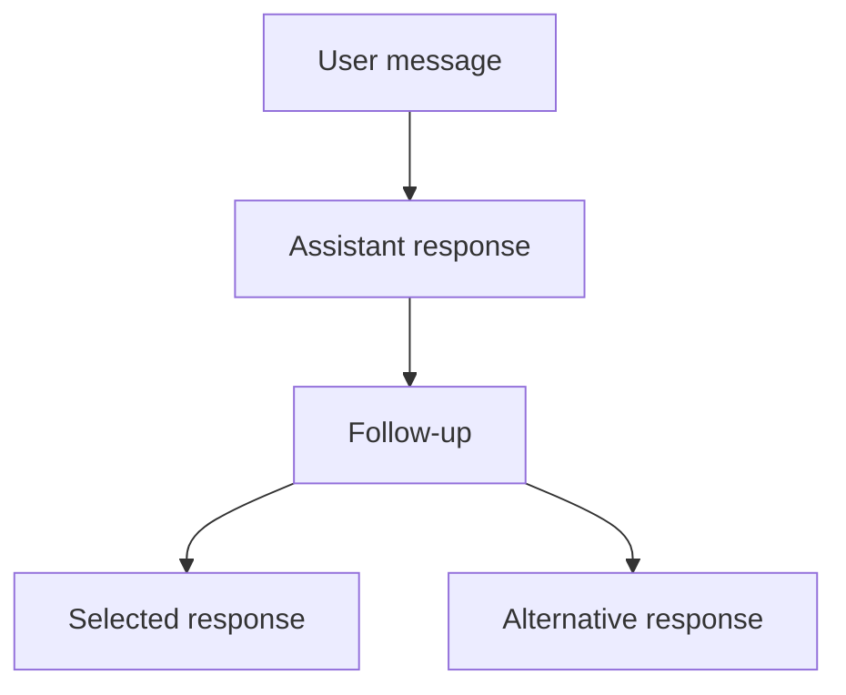

`useThread` is the client runtime behind branching conversations in ChatJS. It
keeps the familiar AI SDK `useChat` interface for the selected conversation
while storing every message and response branch in a complete tree.

Use it when people need to edit earlier messages, compare alternative replies,
or move between branches while responses continue streaming.

## Install

```bash
bun add @chatjs/thread ai @ai-sdk/react
```

Replace the `useChat` import without changing your existing message list or
composer:

```diff
- import { useChat } from "@ai-sdk/react";
+ import { useThread } from "@chatjs/thread/react";

- const chat = useChat({ transport });
+ const chat = useThread({ transport });
```

The top-level helpers remain compatible with `UseChatHelpers`, including
`messages`, `sendMessage`, `regenerate`, `stop`, `status`, tools, and approvals.

## Mental model

`useThread` separates four concepts:

- **Tree:** every message and its parent-child relationship
- **Cursor:** the message currently selected by the application
- **Active path:** the root-to-cursor messages exposed as `chat.messages`
- **Run:** one assistant response with its own status, error, and stop control



Moving the cursor changes the active path. It does not delete descendants or
stop runs on other branches.

## Create a branch

Select any message and send normally. The new user message becomes a child of
the selected node.

```ts
chat.tree.setCursor(messageId);
await chat.sendMessage({ text: "Explore another approach" });
```

Editing is an application-level operation. Select the original user message's
parent, then send the replacement as a new message:

```ts
chat.tree.setCursorToParentOf(originalMessageId);
await chat.sendMessage({
  id: crypto.randomUUID(),
  role: "user",
  parts: [{ type: "text", text: editedText }],
});
```

See [Branching](../features/branching) for the ChatJS user experience.

## Run parallel responses

Each assistant response is an independent run. Start the first response with a
new user message, then start alternatives from that same user node:

```ts
const primary = await chat.tree.startRun({
  message: { text: "Give me three options" },
  follow: true,
});

const userMessageId = primary.getSnapshot()?.userMessageId;

if (userMessageId) {
  const alternatives = await Promise.all([
    chat.tree.startRun({ from: userMessageId, follow: false }),
    chat.tree.startRun({ from: userMessageId, follow: false }),
  ]);

  await Promise.all([
    primary.finished,
    ...alternatives.map((run) => run.finished),
  ]);
}
```

`follow: false` leaves the cursor unchanged while the response streams into its
reserved assistant node. ChatJS uses this model for multiple replies from the
same model and for comparisons across different models.

See [Parallel Responses](../features/parallel-responses) for the product flow.

## Status and controls

Top-level state describes the selected path:

```ts
chat.status;
chat.error;
await chat.stop();
```

Tree state describes all runs:

```ts
chat.tree.status;
chat.tree.activeRuns;
chat.tree.runs;

await chat.tree.stopRun(runId);
await chat.tree.stopAll();
```

Statuses use the AI SDK values `submitted`, `streaming`, `ready`, and `error`.

## Persist the tree

Save the complete tree instead of only the selected `chat.messages` path:

```ts
const snapshot = chat.tree.getSnapshot();
await saveThread(snapshot);
```

Restore it with `initialTree`:

```ts
const chat = useThread({
  initialTree: savedSnapshot,
  transport,
});
```

Snapshots contain messages, parent links, child ordering, roots, and the
cursor. Active request objects are not persisted.

For the complete interface, transport metadata, and runtime exports, see the
[package guide](https://github.com/franciscomoretti/chat-js/tree/main/packages/thread).
