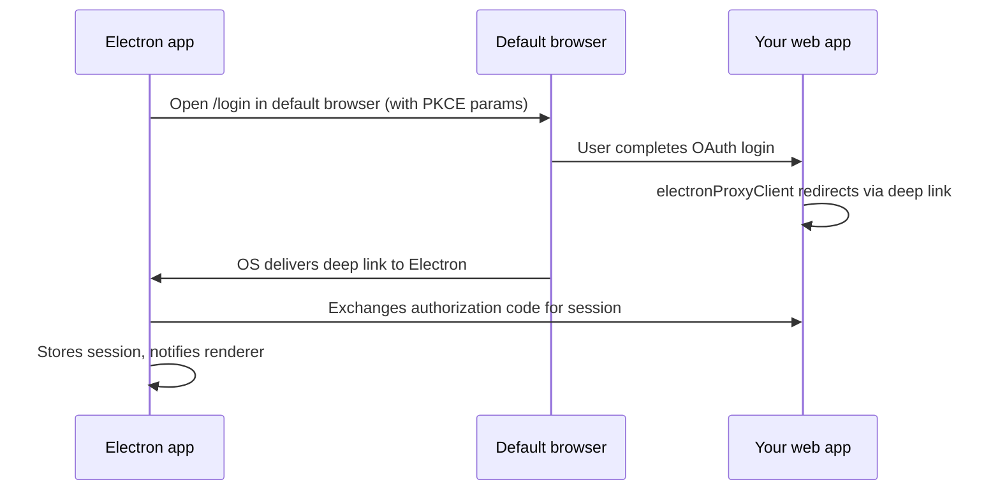

The Electron integration wraps your Next.js web app in a native desktop shell. The Electron process loads your deployed (or local dev) web app in a `BrowserWindow` and handles platform-level concerns: system tray, OAuth deep links, auto-updates, and native title bar styling.

## Scaffold with the CLI

When you run `npx @chat-js/cli@latest create`, the CLI asks:

```
Include an Electron desktop app? › No / Yes
```

Choosing **Yes** copies the Electron template into an `electron/` subfolder inside your project:

```
my-app/
├── app/                        # Next.js app (unchanged)
├── electron/
│   ├── src/
│   │   ├── main.ts             # Main process: window, tray, auth, auto-updater
│   │   ├── preload.ts          # Context bridge + @better-auth/electron renderer setup
│   │   ├── preload.d.ts        # Type declarations for auth bridges
│   │   ├── config.ts           # Reads APP_NAME, APP_SCHEME, APP_URL from chat.config.ts
│   │   └── lib/
│   │       └── auth-client.ts  # Electron auth client (@better-auth/electron)
│   ├── icon.png                # App icon (512×512 PNG, edit this)
│   ├── build/
│   │   ├── icon.png            # Copied from icon.png (generated)
│   │   └── icon.icns           # macOS icon (generated)
│   ├── electron-builder.config.js  # Build config: reads branding.json for appId, productName, protocols
│   ├── entitlements.mac.plist  # macOS hardened runtime entitlements
│   └── package.json
└── chat.config.ts
```

The CLI pre-fills the GitHub `owner` and `repo` in `electron-builder.config.js`. The app name, URL scheme, appId, and production URL all derive automatically from `chat.config.ts`.

## Development

Start the Next.js web app first, then launch Electron pointing at `localhost:3000`:

```bash
# Terminal 1 — web app
npm run dev

# Terminal 2 — Electron
cd electron
bun install
bun run dev
```

In development, `src/config.ts` sets `APP_URL` to `http://localhost:3000` automatically when `NODE_ENV === "development"`.

DevTools open in a detached window automatically in development mode.

## Authentication

OAuth cannot redirect back to a traditional `http://` URL inside Electron. The integration uses the [`@better-auth/electron`](https://better-auth.com/docs/integrations/electron) plugin to handle this with a **custom URL scheme deep link** and PKCE-based token exchange.

### How it works



The `@better-auth/electron` plugin handles the full flow:

- **Server** (`lib/auth.ts`) — the `electron()` plugin adds the authorization code exchange endpoints
- **Web client** (`lib/auth-client.ts`) — the `electronProxyClient()` plugin handles the redirect back to Electron after OAuth
- **Electron main** (`src/main.ts`) — `authClient.setupMain()` registers protocol handlers and IPC bridges
- **Electron preload** (`src/preload.ts`) — `setupRenderer()` exposes `window.requestAuth()`, `window.onAuthenticated()`, and other bridges to the renderer

### Configuring the URL scheme

The URL scheme (e.g. `myapp`, which produces deep links like `myapp://auth/callback`) comes from the `appPrefix` field in `chat.config.ts`. Update it there and the change propagates automatically to `src/config.ts` and `electron-builder.config.js` via the prebuild step.

```ts
// chat.config.ts
const config = defineConfig({
  appPrefix: "myapp", // sets the deep link scheme
  // ...
});
```

## System Tray

The app minimizes to the system tray instead of quitting when you close the window. The tray icon shows a context menu with **Show** and **Quit** options.

Closing the window hides it. Use **Quit** from the tray to fully exit.

## Auto-Updates

The integration uses `electron-updater` with GitHub Releases as the update source. When a packaged app starts, it checks for updates automatically and installs them on next quit.

The `publish` block in `electron-builder.config.js` controls the GitHub repository:

```js
publish: {
  provider: "github",
  owner: "your-github-username",
  repo: "your-repo-name",
  releaseType: "release",
},
```

The CLI pre-fills `owner` and `repo` from your project. Updates only run when the app is packaged (`app.isPackaged`). They are skipped in development.

## Customization

### App icon

Replace `electron/icon.png` with your own 512x512 PNG, then regenerate platform icons:

```bash
cd electron
npm run generate-icons
```

This produces `build/icon.png` and `build/icon.icns` (macOS).

### App name, scheme, and production URL

All branding values come from `chat.config.ts` in your project root. Edit the relevant fields there:

```ts
// chat.config.ts
const config = defineConfig({
  appName: "My App",        // display name shown in the OS
  appPrefix: "myapp",       // URL scheme and appId prefix
  appUrl: "https://my-app.vercel.app", // production URL loaded by Electron
  // ...
});
```

Before each build, a prebuild step runs `bun scripts/write-branding.ts`, which reads `chat.config.ts` and writes a `branding.json` file. `electron-builder.config.js` reads `branding.json` at build time to set `productName`, `appId`, protocol schemes, and copyright.

You do not need to edit any files inside `electron/` to change the app name, scheme, or URL.

## Building for Distribution

Build a distributable installer with one of the platform commands:

```bash
cd electron
bun run dist:mac    # macOS .dmg (x64 + arm64)
bun run dist:win    # Windows NSIS installer (x64)
bun run dist:linux  # Linux AppImage (x64)
```

Built artifacts are placed in `electron/release/`. To install:

- **macOS** — run `open release/ChatJS-0.1.0-arm64.dmg`, then drag the app to your Applications folder
- **Windows** — run the `.exe` installer
- **Linux** — make the `.AppImage` executable and run it

To test the packaged build without creating an installer, use `bun run package`. This produces an unpacked app directory in `release/` that you can launch directly without going through an install step.

For macOS distribution outside the App Store, the build uses hardened runtime with the entitlements in `entitlements.mac.plist`. Notarization requires additional setup with your Apple Developer account.
