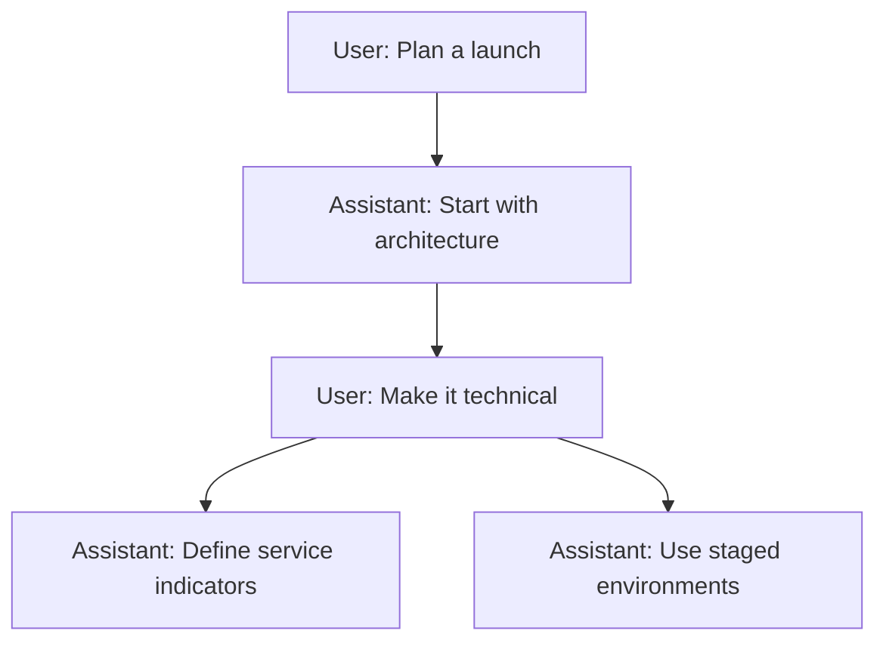

Branching lets you fork a conversation at any message and explore another
direction without replacing the original path. Editing a message or generating
another response creates a sibling that you can return to later.

<Frame>
  
</Frame>

## How it works

Every message has a parent, which forms a conversation tree. ChatJS displays
one root-to-message path at a time while keeping the other branches available.

The selected message is the cursor. Sending a message continues from that
cursor, so selecting an earlier node before sending creates a new branch.

## Navigate branches

When a message has siblings, arrow controls show the current position, such as
`2/3`. Use the arrows to move to the previous or next branch.

Switching branches:

- changes the active conversation path
- preserves responses that are still streaming on other branches
- clears transient data that belongs to the previous path
- closes an open artifact when its message is not in the selected path
- follows the selected branch to its latest descendant

## Edit a message

Editing creates a replacement branch. The original message and all of its
descendants remain in the tree, so you can switch back with the same sibling
controls.

## Data model

Messages are persisted with a parent message ID. Root messages have no parent.
The client uses `useThread` to project the selected path and to keep each active
assistant response attached to its own reserved node.

See [useThread](../core/use-thread) for the tree, cursor, active-path, and run
model.

## Related

- [Parallel Responses](./parallel-responses)
- [Architecture](../core/architecture)
