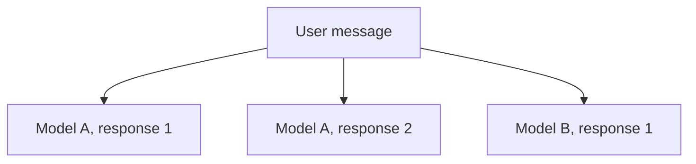

Parallel responses let you request several replies to one user message. You can
compare different models, ask one model for multiple alternatives, or combine
both approaches in the same response group.

## Request responses

1. Open the model selector in the chat input.
2. Enable **Use Multiple Models**.
3. Select the models you want to use.
4. Set the response count for each selected model.
5. Send your message.

The total response count must be greater than one. Selecting one model with a
count of three creates three independent replies from that model. Selecting
three models with a count of one creates one reply from each model.

<Callout type="note">
  Parallel responses require authentication. Anonymous sessions are limited to a
  single model per request.
</Callout>

## Independent runs

ChatJS reserves a message ID for each response and attaches it to an
independent branch. In an active conversation, secondary responses use
`useThread` runs with their own streaming state and stop control.

The first response becomes the selected path. Other responses use background
runs, so they continue streaming when you select another response or navigate
to a different branch.

## Response cards

A card appears for each requested response and shows its model and current
state. Select a card to make that response the active conversation path.

After selecting a response, new messages continue from that branch. The other
responses remain available, including any that are still generating.

## Current constraints

- Attachments cannot be combined with parallel responses yet.
- Each response is billed as a separate model request.
- Stopping the selected response does not stop other active runs. Use the
  branch controls to select another response, or stop all runs through the
  `ThreadChat` engine.

## Related

- [useThread](../core/use-thread)
- [Branching](./branching)
- [Multi-Model Support](../core/multi-model)
