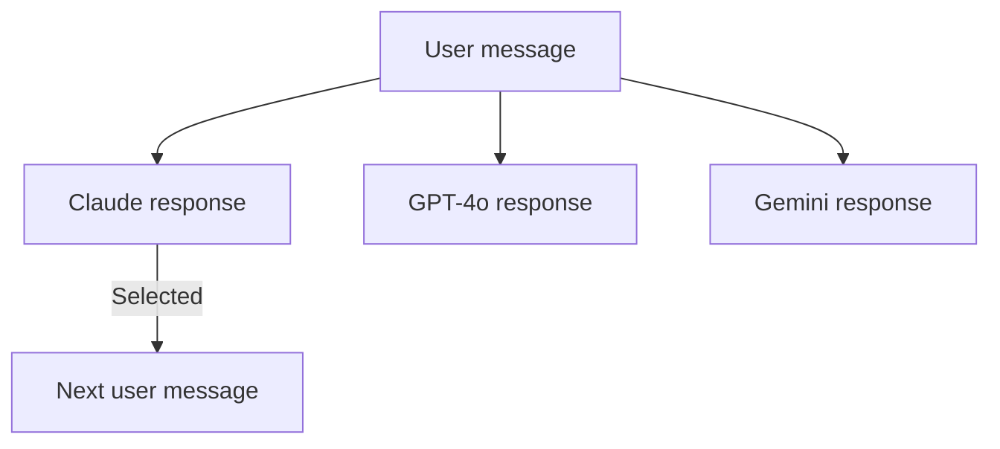

Parallel responses let you select more than one model before submitting a message. ChatJS fans the request out to every selected model at the same time and displays each answer as a clickable card. You can then pick the response you want to continue the conversation with.

## How to Use

1. Open the model selector in the chat input.
2. Toggle **Use Multiple Models**.
3. Select two or more models. Each model shows a count badge when it is part of the parallel set.
4. Type your message and submit.

Each model starts streaming immediately. A row of cards appears above the message showing the model name and current status. Click any card to switch the active thread to that response.

<Note>
  Parallel responses require authentication. Anonymous sessions are limited to a
  single model per request.
</Note>

## Response Cards

Each card in the batch displays:

- The model label
- A streaming indicator while the response is being generated
- One of three states: **Generating**, **Task completed**, or **Selected**

Clicking a card runs `switchToMessage`, which rebuilds the visible thread from that assistant branch down to its most recent leaf. The previously selected branch is preserved and you can return to it at any time by clicking its card again.

## Continuing the Conversation

After you select a card, the conversation continues from that branch as a normal single-model thread. Subsequent messages go only to the model of the selected branch. You can always navigate back up and pick a different card before sending a follow-up.

## Current Constraints

- Parallel responses are not available when the message includes attachments. Mixed model capabilities across attachment types are not yet supported.
- Each model in the parallel set is billed as a separate request.

## Related

- [Branching](/features/branching) - how the underlying thread tree works
- [Multi-Model Support](/core/multi-model) - configuring which models are available
