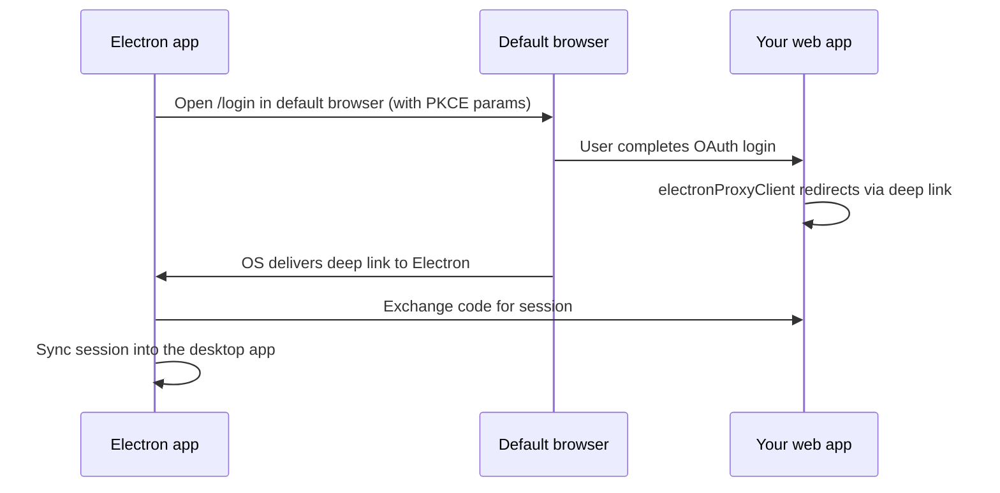

The desktop integration wraps your ChatJS web app in an Electron shell. The Electron process loads your deployed or local app in a `BrowserWindow` and adds desktop-specific behavior such as deep-link authentication, system tray support, native window chrome, and auto-updates.

## Installing a prebuilt release

Prebuilt installers for the ChatJS reference app are published on the [GitHub Releases page](https://github.com/franciscomoretti/chat-js/releases/latest).

<Warning>
  The current releases are **not code-signed or notarized**. Your operating system will show a security warning on first launch. This is expected for unsigned builds and does not mean the app is malicious, but you should only install builds from a source you trust.
</Warning>

Pick your platform below for the install steps.

### macOS

1. Download [`ChatJS-mac.dmg`](https://github.com/franciscomoretti/chat-js/releases/latest/download/ChatJS-mac.dmg) (or browse [all assets](https://github.com/franciscomoretti/chat-js/releases/latest)).
2. Open the `.dmg` and drag **ChatJS** into `Applications`.
3. The first time you launch it, macOS will say the app "cannot be opened because Apple cannot check it for malicious software". Close that dialog.
4. Open **System Settings** and go to **Privacy & Security**. Scroll to the **Security** section. You will see a message about ChatJS being blocked, with an **Open Anyway** button. Click it.
5. Launch ChatJS again and confirm with **Open**.

If the app was quarantined and the "Open Anyway" button does not appear, you can remove the quarantine flag from a terminal:

```bash
xattr -dr com.apple.quarantine /Applications/ChatJS.app
```

Only run that command on a build you downloaded yourself from the official releases page.

### Windows

1. Download [`ChatJS-windows.exe`](https://github.com/franciscomoretti/chat-js/releases/latest/download/ChatJS-windows.exe) (or browse [all assets](https://github.com/franciscomoretti/chat-js/releases/latest)).
2. Windows SmartScreen will show a **Windows protected your PC** dialog because the installer is unsigned.
3. Click **More info**, then **Run anyway**.
4. Complete the installer as usual.

### Linux

1. Download [`ChatJS-linux.AppImage`](https://github.com/franciscomoretti/chat-js/releases/latest/download/ChatJS-linux.AppImage) or [`ChatJS-linux.deb`](https://github.com/franciscomoretti/chat-js/releases/latest/download/ChatJS-linux.deb) (or browse [all assets](https://github.com/franciscomoretti/chat-js/releases/latest)).
2. For the `.AppImage`, make it executable and run it:

   ```bash
   chmod +x ChatJS-linux.AppImage
   ./ChatJS-linux.AppImage
   ```

3. For the `.deb`, install it with `apt` or your package manager of choice:

   ```bash
   sudo apt install ./ChatJS-linux.deb
   ```

Linux does not enforce code signing for desktop apps the same way macOS and Windows do, so there is usually no extra warning step.

### Shipping signed builds

If you are distributing your own fork to end users, see [macOS Distribution Notes](#macos-distribution-notes) below for what is required to ship signed and notarized builds so your users do not see these warnings.

## Scaffold with the CLI

When you run `npx @chat-js/cli@latest create`, the CLI asks:

```bash
Include an Electron desktop app? › No / Yes
```

Choosing **Yes** copies an `electron/` subfolder into your project:

```text
my-app/
├── app/
├── electron/
│   ├── src/
│   │   ├── main.ts
│   │   ├── preload.ts
│   │   ├── preload.d.ts
│   │   ├── config.ts
│   │   └── lib/
│   │       └── auth-client.ts
│   ├── build/
│   ├── forge.config.ts
│   ├── icon.png
│   ├── entitlements.mac.plist
│   └── package.json
└── chat.config.ts
```

The generated desktop app derives its app name, protocol scheme, and production URL from `chat.config.ts`.

## Development

Start the web app first, then launch Electron:

```bash
# Terminal 1 — web app
bun run dev

# Terminal 2 — Electron
cd electron
bun install
bun run dev
```

Use the same package manager you selected during `create`. If you passed `--package-manager npm` (or another manager), replace `bun` above with that manager.

In development, the Electron wrapper points at `http://localhost:3000` by default.

## Authentication

OAuth redirects cannot return directly to an in-app `http://localhost` page inside Electron. ChatJS uses [`@better-auth/electron`](https://better-auth.com/docs/integrations/electron) to bridge the browser sign-in flow back into the desktop app with a custom URL scheme and PKCE.

### How it works



The main integration points are:

- **Server**: `lib/auth.ts` enables the Electron Better Auth plugin
- **Web client**: `lib/auth-client.ts` handles the browser-side redirect flow
- **Electron main**: `src/main.ts` sets up deep-link handling and IPC bridges
- **Electron preload**: `src/preload.ts` exposes auth bridges to the renderer

## Custom URL Scheme

The desktop auth scheme comes from `appPrefix` in `chat.config.ts`.

```ts
const config = defineConfig({
  appPrefix: "myapp",
});
```

That value flows into Electron protocol registration and desktop auth callbacks automatically.

## Auto-Updates

The desktop integration uses `update-electron-app` with a public GitHub repository. Packaged builds check GitHub Releases for newer versions automatically.

## Customization

### App icon

Replace `electron/icon.png` with your own 512x512 PNG, then regenerate the platform-specific assets:

```bash
cd electron
bun run generate-icons
```

### App name, scheme, and production URL

Edit `chat.config.ts` in your project root:

```ts
const config = defineConfig({
  appName: "My App",
  appPrefix: "myapp",
  appUrl: "https://my-app.vercel.app",
});
```

Before each build, the Electron prebuild step writes a `branding.json` file from those values so the desktop app stays aligned with your web app branding.

## Building for Distribution

Build desktop installers from the `electron/` directory:

```bash
cd electron
bun run make:mac
bun run make:win
bun run make:linux
```

Build outputs are written to `electron/out/`.

- **macOS**: `.dmg` and `.zip`
- **Windows**: `.exe` installer
- **Linux**: `.deb` and `.rpm`

To test the packaged app without an installer, use:

```bash
bun run package
```

## Release Flow

In the ChatJS monorepo, desktop releases follow the same version-bump PR model used for package releases:

1. Add a changeset that includes `@chatjs/electron`
2. Let the Changesets workflow open the version PR
3. Merge that version PR
4. The Electron release workflow reads the new `apps/electron/package.json` version, builds macOS, Windows, and Linux artifacts, and publishes them to GitHub Releases

For a concrete reference, see the workflow used in this repository:

- [`.github/workflows/electron-release.yml`](https://github.com/franciscomoretti/chat-js/blob/main/.github/workflows/electron-release.yml)

If you scaffold a new app with the Electron option, you get the desktop app code and Forge config, but not this repository's release automation automatically. Use the workflow above as a starting point for your own project if you want the same PR-driven release flow.

## macOS Distribution Notes

For public macOS distribution outside the App Store, you will usually want:

- code signing
- notarization
- a stable bundle identifier and install path

The generated app includes the hardened runtime entitlements file, but notarization and signing still require your Apple Developer credentials and CI setup.
